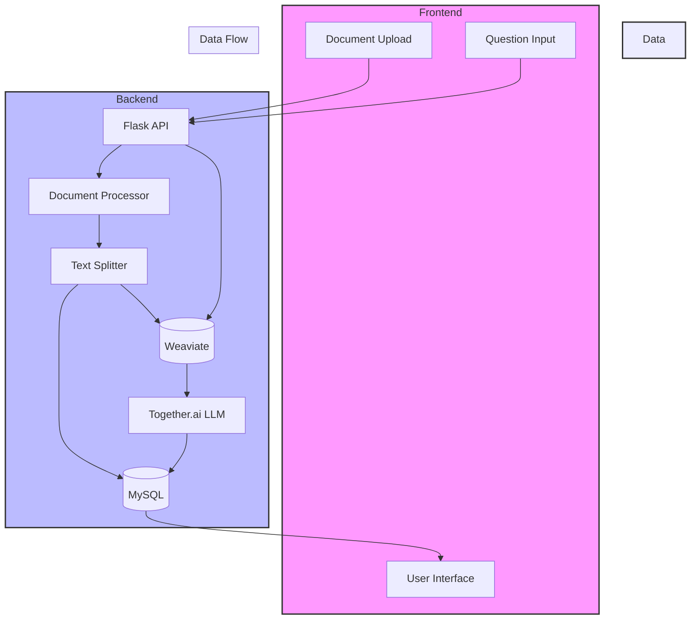

# RAG Application

A Retrieval Augmented Generation (RAG) application that allows users to upload documents, ask questions about them, and receive contextually relevant answers using advanced AI technologies.

## Features

- Document upload support for PDF and DOCX files
- Document processing and chunking with RecursiveCharacterTextSplitter
- Vector storage using Weaviate for efficient semantic search
- Question answering using Llama 3.3-70B-Instruct-Turbo via Together.ai
- Conversation history management with MySQL
- Modern React-based web interface with Material-UI
- Docker containerization for easy deployment
- Nginx reverse proxy for frontend serving

## Technical Architecture Overview

The application follows a modern microservices architecture with the following key components:

### Backend Services
- **API Server**: Flask-based REST API handling document processing and Q&A
- **Vector Database**: Weaviate for semantic search and vector storage
- **Relational Database**: MySQL for storing document metadata and conversation history
- **LLM Service**: Integration with Together.ai for embeddings and text generation

### Frontend Services
- **Web Application**: React-based SPA with Material-UI
- **Static File Server**: Nginx for serving frontend assets
- **API Gateway**: Nginx reverse proxy for API routing

### Data Flow
1. Document upload → API Server → Document Processor → Vector DB + MySQL
2. User Query → API Server → Vector Search → LLM → Response → MySQL
3. Frontend → API Gateway → Backend Services → Frontend

## Flow Chart



## Vector Database Selection

Weaviate was chosen over Pinecone for the following reasons:

### Weaviate Advantages
- **Cloud-Native Architecture**: Built for modern cloud environments
- **Managed Service**: Reduces operational overhead
- **Built-in Text2Vec**: Native support for text embeddings
- **LangChain Integration**: Seamless integration with LangChain framework
- **Free Tier**: Available for development and testing
- **Community Support**: Active community and regular updates
- **Search Capabilities**: Advanced near_vector search with metadata filtering
- **Scalability**: Excellent performance at scale

### Why Not Pinecone?
- **Cost**: Higher pricing for production workloads
- **Limited Free Tier**: More restricted free tier compared to Weaviate
- **Complex Setup**: More complex initial setup and configuration
- **Limited Metadata**: Less flexible metadata handling
- **API Complexity**: More complex API for basic operations

## Setup Instructions

### Prerequisites
- Docker and Docker Compose
- Git
- Python 3.8+ (for local development)
- Node.js 16+ (for local development)

### Environment Setup
1. Clone the repository:
   ```bash
   git clone https://github.com/yourusername/rag-app.git
   cd rag-app
   ```

2. Create environment file:
   ```bash
   cp .env.example .env
   ```

3. Configure environment variables in `.env`:
   ```
   WEAVIATE_URL=your_weaviate_url
   WEAVIATE_API_KEY=your_weaviate_key
   TOGETHER_API_KEY=your_together_key
   MYSQL_HOST=mysql
   MYSQL_USER=your_mysql_user
   MYSQL_PASSWORD=your_mysql_password
   MYSQL_DB=ragdb
   ```

### Docker Deployment
1. Build and start containers:
   ```bash
   docker-compose up --build
   ```

2. Access the application:
   - Frontend: http://localhost:3000
   - Backend API: http://localhost:5000

### Local Development
1. Create Python virtual environment:
   ```bash
   python -m venv venv
   source venv/bin/activate  # On Windows: venv\Scripts\activate
   ```

2. Install backend dependencies:
   ```bash
   pip install -r requirements.txt
   ```

3. Install frontend dependencies:
   ```bash
   cd frontend
   npm install
   ```

4. Start development servers:
   ```bash
   # Terminal 1 - Backend
   python app.py

   # Terminal 2 - Frontend
   cd frontend
   npm start
   ```

## Technical Architecture

### Backend (Python/Flask)
- Flask for RESTful API development
- LangChain for RAG implementation
- Weaviate for vector storage and semantic search
- MySQL for conversation and document storage
- Together.ai API for LLM access
- Document processing with PyPDF and python-docx
- CORS support for frontend communication

### Frontend (React)
- React with Material-UI components
- React Router for navigation
- Axios for API communication
- Nginx for serving static files
- Responsive design with Material-UI theming

### Database Schema
- `documents`: Stores uploaded document metadata
- `document_chunks`: Stores processed document chunks
- `conversations`: Stores Q&A history

## Process Flow

1. **Document Upload & Processing**
   - User uploads PDF/DOCX file
   - Backend processes document using appropriate parser
   - Text is split into chunks using RecursiveCharacterTextSplitter
   - Chunks are stored in MySQL and Weaviate

2. **Question Answering**
   - User selects document and asks question
   - Question is embedded using Together.ai embeddings
   - Weaviate performs semantic search to find relevant chunks
   - Context is provided to Llama model for answer generation
   - Conversation is stored in MySQL

3. **Vector Search**
   - Uses Weaviate's near_vector search
   - Configurable similarity threshold (0.7)
   - Returns top 3 most relevant chunks
   - Maintains document flow through chunk indexing

## API Endpoints

- `POST /api/upload`: Upload and process documents
- `POST /api/chat`: Send questions and receive AI-generated answers
- `GET /api/conversations`: Retrieve conversation history
- `GET /api/documents`: List uploaded documents
- `POST /api/clear-chat-history`: Clear session chat history

## Environment Variables

Required environment variables:
- `WEAVIATE_URL`: Weaviate instance URL
- `WEAVIATE_API_KEY`: Weaviate API key
- `TOGETHER_API_KEY`: Together.ai API key
- `MYSQL_HOST`: MySQL host
- `MYSQL_PORT`: MySQL port (default: 3306)
- `MYSQL_USER`: MySQL username
- `MYSQL_PASSWORD`: MySQL password
- `MYSQL_DB`: MySQL database name
- `FLASK_SECRET_KEY`: Flask session secret key

## Dependencies

### Backend
- Flask and Flask-CORS
- LangChain and related packages
- Weaviate client
- MySQL connector
- Document processing libraries (PyPDF, python-docx)
- Together.ai integration

### Frontend
- React and React Router
- Material-UI components
- Axios for API calls
- Nginx for serving static files

## Contributing

1. Fork the repository
2. Create a feature branch
3. Commit your changes
4. Push to the branch
5. Create a Pull Request 